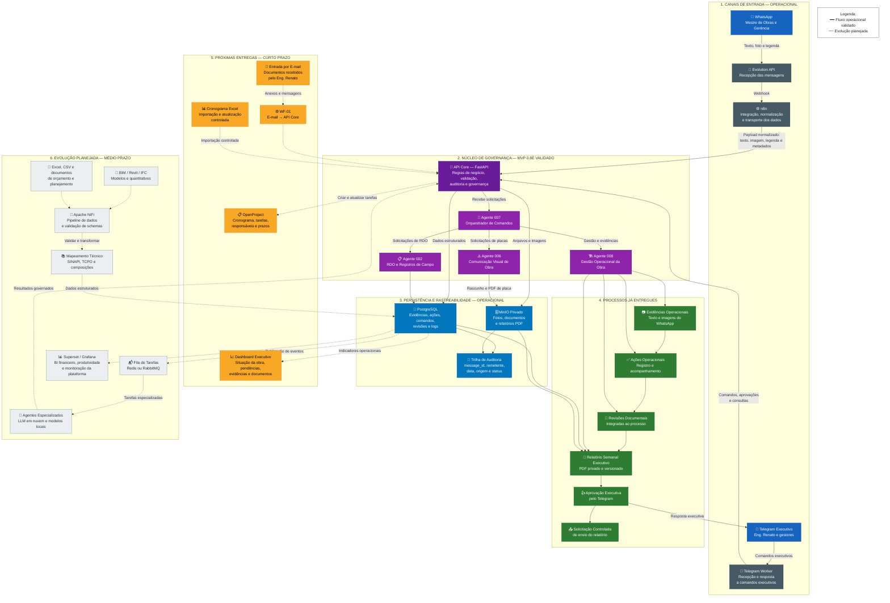

```mermaid
flowchart TB

%% =========================================================
%% PROJETO GARCIA — ARQUITETURA ATUAL E ROADMAP
%% =========================================================

subgraph S1["1. CANAIS DE ENTRADA — OPERACIONAL"]
    direction LR

    WA["📱 WhatsApp<br/>Mestre de Obras e Gerência"]
    EV["🔗 Evolution API<br/>Recepção das mensagens"]
    N8N["⚙️ n8n<br/>Integração, normalização<br/>e transporte dos dados"]

    TG["💬 Telegram Executivo<br/>Eng. Renato e gestores"]
    TW["🤖 Telegram Worker<br/>Recepção e resposta<br/>a comandos executivos"]

    WA -->|"Texto, foto e legenda"| EV
    EV -->|"Webhook"| N8N

    TG -->|"Comandos executivos"| TW
end


subgraph S2["2. NÚCLEO DE GOVERNANÇA — MVP 0.8E VALIDADO"]
    direction LR

    API["🧩 API Core — FastAPI<br/>Regras de negócio, validação,<br/>auditoria e governança"]

    A007["🧠 Agente 007<br/>Orquestrador de Comandos"]

    A008["🏗️ Agente 008<br/>Gestão Operacional da Obra"]

    A002["📋 Agente 002<br/>RDO e Registros de Campo"]

    A006["⚠️ Agente 006<br/>Comunicação Visual de Obra"]

    API -->|"Recebe solicitações"| A007

    A007 -->|"Gestão e evidências"| A008
    A007 -->|"Solicitações de RDO"| A002
    A007 -->|"Solicitações de placas"| A006
end


N8N -->|"Payload normalizado:<br/>texto, imagem, legenda e metadados"| API
TW -->|"Comandos, aprovações<br/>e consultas"| API


subgraph S3["3. PERSISTÊNCIA E RASTREABILIDADE — OPERACIONAL"]
    direction LR

    PG["🐘 PostgreSQL<br/>Evidências, ações, comandos,<br/>revisões e logs"]

    MINIO["🗄️ MinIO Privado<br/>Fotos, documentos<br/>e relatórios PDF"]

    AUDIT["🔐 Trilha de Auditoria<br/>message_id, remetente,<br/>data, origem e status"]

    API -->|"Dados estruturados"| PG
    API -->|"Arquivos e imagens"| MINIO

    PG --> AUDIT
    MINIO --> AUDIT
end


subgraph S4["4. PROCESSOS JÁ ENTREGUES"]
    direction LR

    EVID["📷 Evidências Operacionais<br/>Texto e imagens do WhatsApp"]

    ACTIONS["✅ Ações Operacionais<br/>Registro e acompanhamento"]

    DOCS["📑 Revisões Documentais<br/>Integradas ao processo"]

    REPORT["📝 Relatório Semanal Executivo<br/>PDF privado e versionado"]

    APPROVAL["👍 Aprovação Executiva<br/>pelo Telegram"]

    SEND["📤 Solicitação Controlada<br/>de envio do relatório"]

    EVID --> ACTIONS
    ACTIONS --> DOCS
    DOCS --> REPORT
    REPORT --> APPROVAL
    APPROVAL --> SEND
end


A008 --> EVID
A008 --> ACTIONS
A008 --> DOCS
A008 --> REPORT

A002 --> PG
A006 -->|"Rascunho e PDF de placa"| MINIO

PG --> REPORT
MINIO --> REPORT

APPROVAL -->|"Resposta executiva"| TG


subgraph S5["5. PRÓXIMAS ENTREGAS — CURTO PRAZO"]
    direction LR

    EMAIL["📧 Entrada por E-mail<br/>Documentos recebidos<br/>pelo Eng. Renato"]

    WFEMAIL["⚙️ WF-01<br/>E-mail → API Core"]

    OPENPROJECT["📋 OpenProject<br/>Cronograma, tarefas,<br/>responsáveis e prazos"]

    EXCEL["📊 Cronograma Excel<br/>Importação e atualização<br/>controlada"]

    DASH["📈 Dashboard Executivo<br/>Situação da obra, pendências,<br/>evidências e documentos"]

    EMAIL -.->|"Anexos e mensagens"| WFEMAIL
    WFEMAIL -.-> API

    EXCEL -.->|"Importação controlada"| API
    API -.->|"Criar e atualizar tarefas"| OPENPROJECT

    PG -.->|"Indicadores operacionais"| DASH
end


subgraph S6["6. EVOLUÇÃO PLANEJADA — MÉDIO PRAZO"]
    direction LR

    BIM["🏢 BIM / Revit / IFC<br/>Modelos e quantitativos"]

    FILES["📄 Excel, CSV e documentos<br/>de orçamento e planejamento"]

    NIFI["🔄 Apache NiFi<br/>Pipeline de dados<br/>e validação de schemas"]

    MAP["📚 Mapeamento Técnico<br/>SINAPI, TCPO e composições"]

    QUEUE["📬 Fila de Tarefas<br/>Redis ou RabbitMQ"]

    AI["🤖 Agentes Especializados<br/>LLM em nuvem e modelos locais"]

    BI["📊 Superset / Grafana<br/>BI financeiro, produtividade<br/>e monitoração da plataforma"]

    BIM -.-> NIFI
    FILES -.-> NIFI

    NIFI -.->|"Validar e transformar"| MAP
    MAP -.->|"Dados estruturados"| PG

    PG -.->|"Publicação de eventos"| QUEUE
    QUEUE -.->|"Tarefas especializadas"| AI
    AI -.->|"Resultados governados"| API

    PG -.-> BI
end


%% =========================================================
%% LEGENDA
%% =========================================================

LEGEND["Legenda:<br/>━━ Fluxo operacional validado<br/>┄┄ Evolução planejada"]


%% =========================================================
%% ESTILOS
%% =========================================================

classDef channel fill:#1565C0,stroke:#0D47A1,color:#FFFFFF;
classDef integration fill:#455A64,stroke:#263238,color:#FFFFFF;
classDef core fill:#6A1B9A,stroke:#4A148C,color:#FFFFFF;
classDef agent fill:#8E24AA,stroke:#4A148C,color:#FFFFFF;
classDef storage fill:#0277BD,stroke:#01579B,color:#FFFFFF;
classDef delivered fill:#2E7D32,stroke:#1B5E20,color:#FFFFFF;
classDef next fill:#F9A825,stroke:#F57F17,color:#000000;
classDef future fill:#ECEFF1,stroke:#78909C,color:#263238;
classDef legend fill:#FFFFFF,stroke:#616161,color:#212121;

class WA,TG channel;
class EV,N8N,TW integration;
class API core;
class A007,A008,A002,A006 agent;
class PG,MINIO,AUDIT storage;
class EVID,ACTIONS,DOCS,REPORT,APPROVAL,SEND delivered;
class EMAIL,WFEMAIL,OPENPROJECT,EXCEL,DASH next;
class BIM,FILES,NIFI,MAP,QUEUE,AI,BI future;
class LEGEND legend;
```